## Řešení úkolu 3

### Řešení problému
Snažil jsem se co nejvíce použít kód ze cvičení.
Konkrétně jsem se nejprve pokusil sdílet feromony pro všechny autíčka ale to mi skoro vždy zdegenerovalo.
Proto jsem nakonec feromony mezi autíčky nesdílel. Což učinilo pro autíčka obtížnější si prohodit části svých cest (ale dost možná to není potřeba).

Konkrétní rozdíly od řešení jsem popsal ve svém kódu. Nicméně nejdůležitější jsou:
- solution se skládá z několika okruhů autíček. Autíčka neobjíždí vrcholy ale jednotlivé balíčky.

Nejdůležitější se ukázalo používat správně heuristiku o preferování blízkých balíčků (nemohl jsem převzít původní, protože některé balíčky sdílejí pozici). Pokud jsem tuto heuristiku zahodil, tak se mravenci nebili schopní dopracovat rozumného řešení, protože rozdíl v fitness byl velmi malý (trochu pomohlo zvednou alpha, což zvýraznilo rozdíly ve fitness hodnotě).

Výsledek nejmenšího řešení je takovéto:

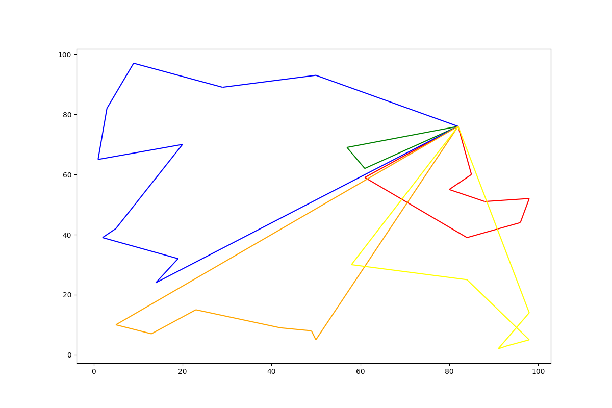
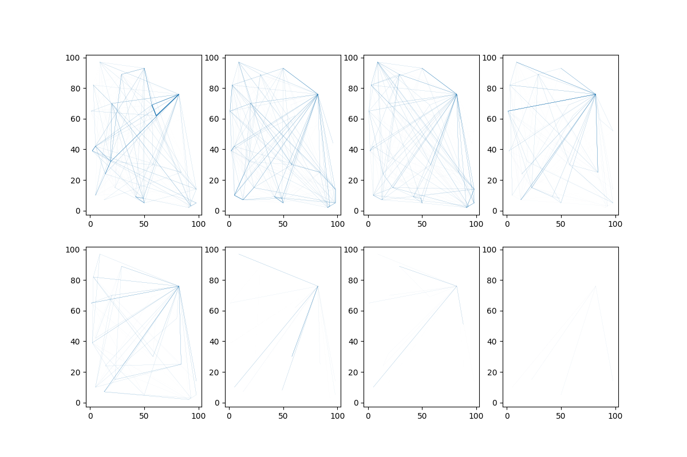

Zkoušel jsem s hrát se všemi parametry a většinou jsem nevypozoroval nějaké výrazné zlepšení.
Určitě pomohl větší čas. Zároveň mi trochu pomohlo snížit rho na .5 což si vysvětluji tak, že se umí cesty jednodušeji měnit (nejsou tak moc ovlivněny historií). Zároveň na grafu jsou vidět rozumnější feromonové cesty

Řešení s nižším `rho=0.5`:

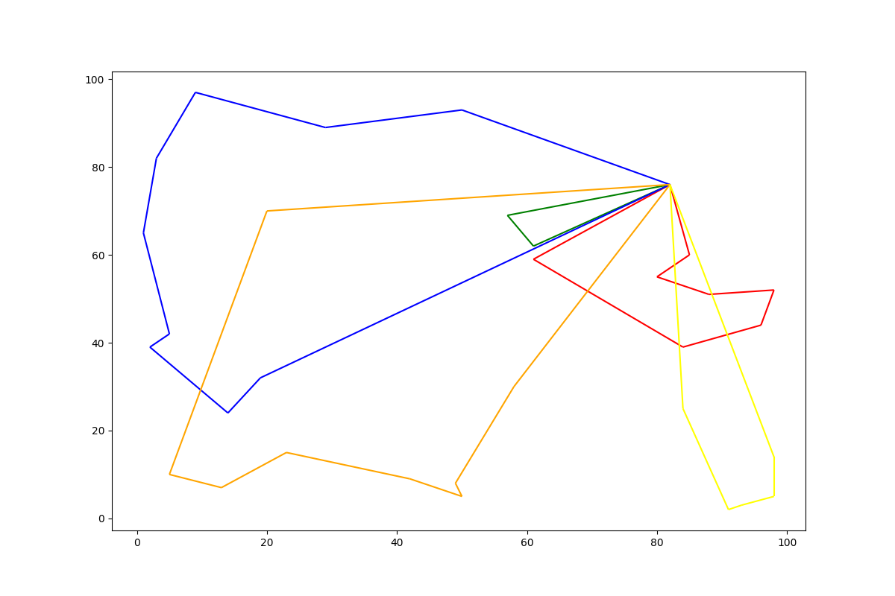
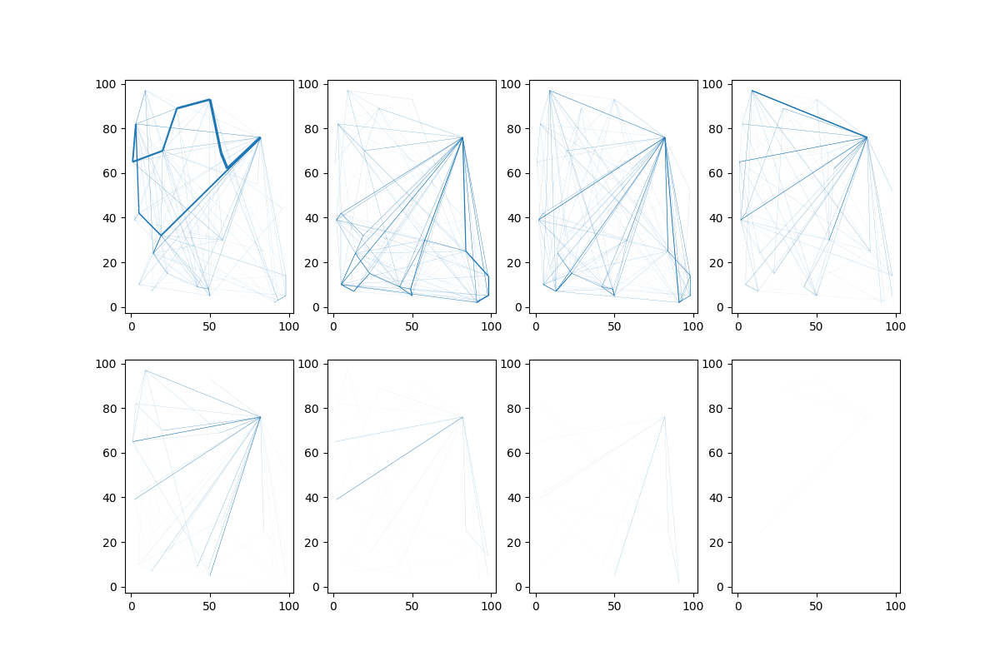

Zároveň jsem zkoušel hýbat počtem mravenců ale to moc nepomohlo.

### Výsledky

Výsledek nejmenšího datasetu je vzdálenost `877`.

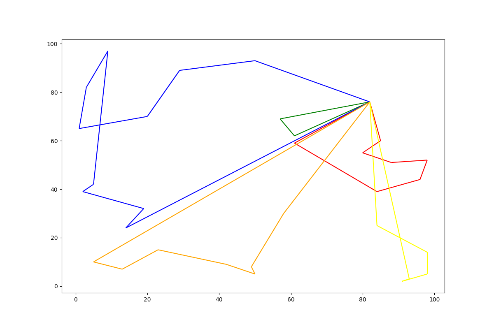
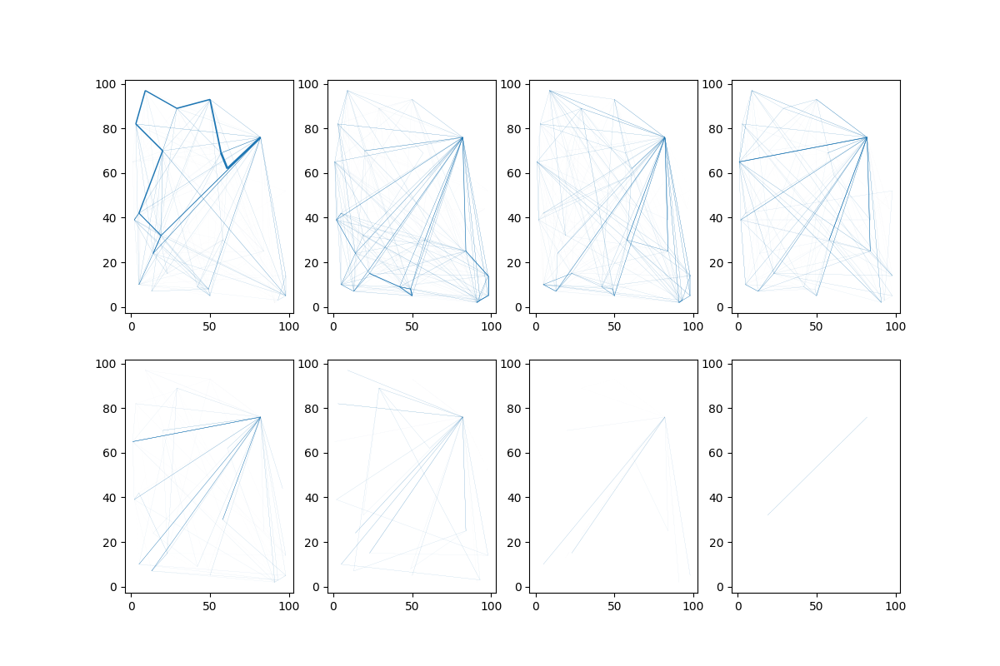
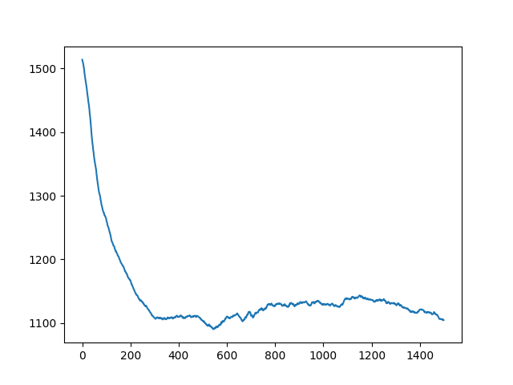

Výsledek prostředního datasetu je vzdálenost `334`.

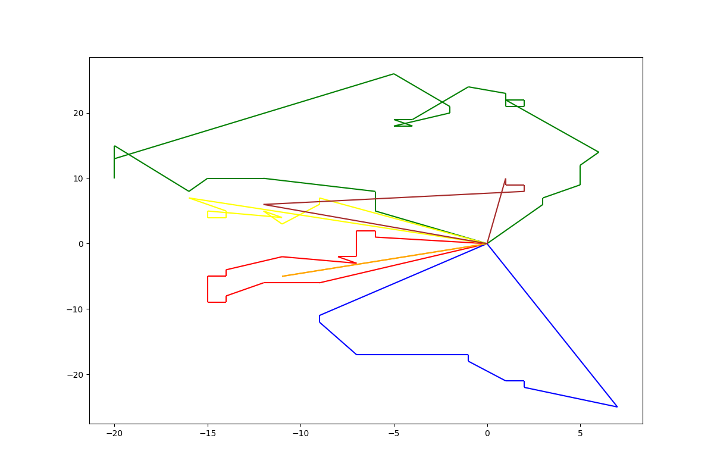
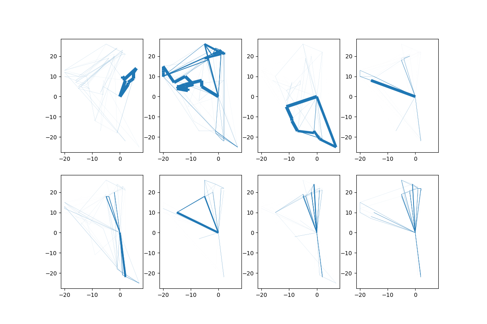
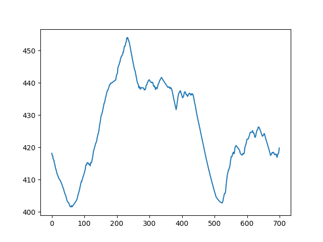

Výsledek největšího datasetu je ale nic moc. Dost mi to zdegenerovalo jak je vidět na progressu.

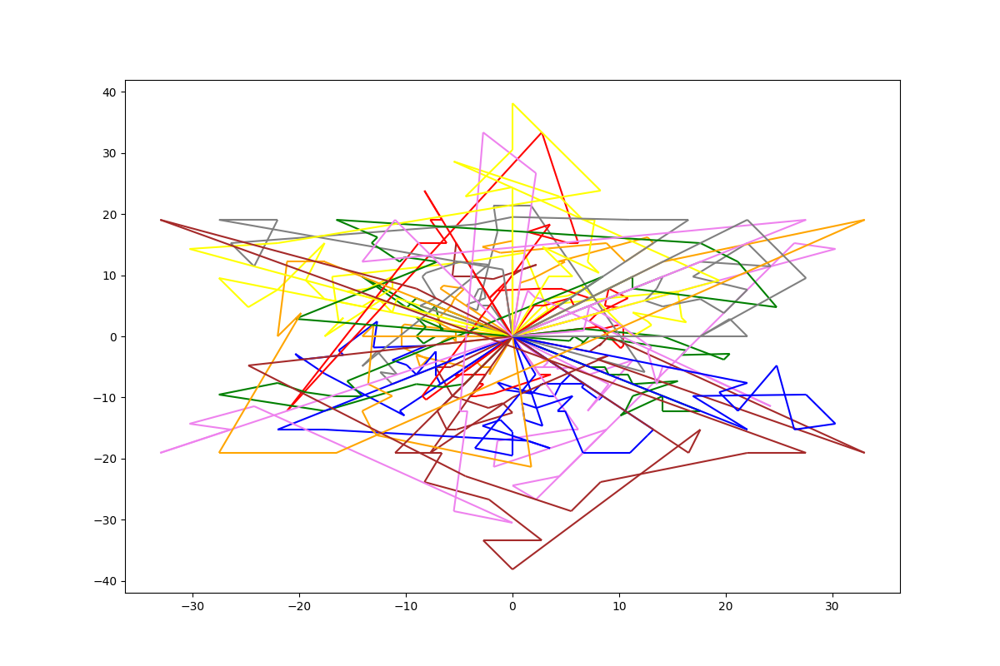
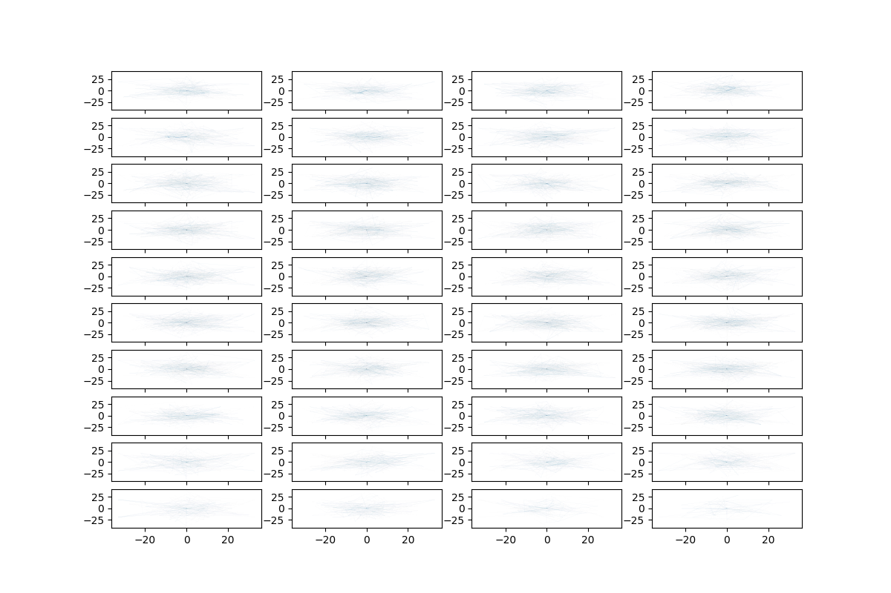
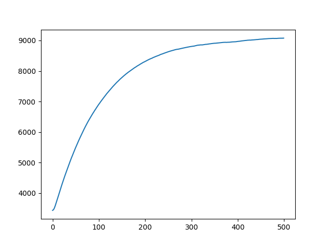

Ani když jsem ladil hyper parametry přesně pro větší vstup, tak se mi nepovedlo dostat rozumné řešení (jedna iterace trvá přibližně 4 vteřiny a nechával jsem to běhat ~300 iterací).

Pro poslední stup se mi vyplatilo zvednou `alpha=3` a `beta=5`. Trénuje se to mnohem stabilněji. I když výsledky nejsou pořád nic moc. Ale podle trndu by to mohlo něco dělat, kdybych to nechal trénovat přes noc.

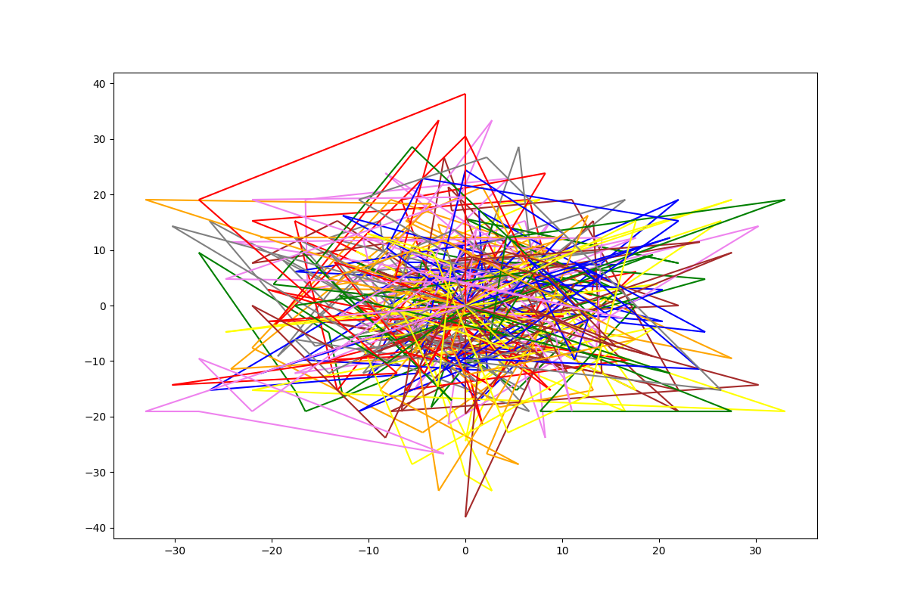
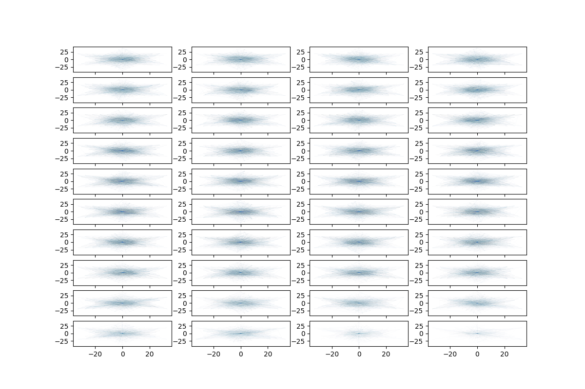

Nejlepší výsledek pro velký vstup: `8926`, který je ale dost špatný (viz obrázek).

#### Časy
Původně mi algoritmy běželi v $\mathcal{O(n^3)}$ což bylo pro největší vstup dost nepoužitelné. Povedlo se mi to ale zrychlit tím, že jsem omezil maximální počet použitých aut (viz kód).
Teď už to běží v čase $\mathcal{O(n^2 \cdot max_cars)}$. To jsou pro jednodušší vstupy minuty a pro těžší desítky minut.

#### Pozorování
Je možné, že toto pozorování je tím, že se mi nepovedlo dosáhnout nějakých extra výsledků při trénování ale v mém řešení má největší vliv výpočet pravděpodobnosti nasvštívení políčka na základě vzdálenosti.