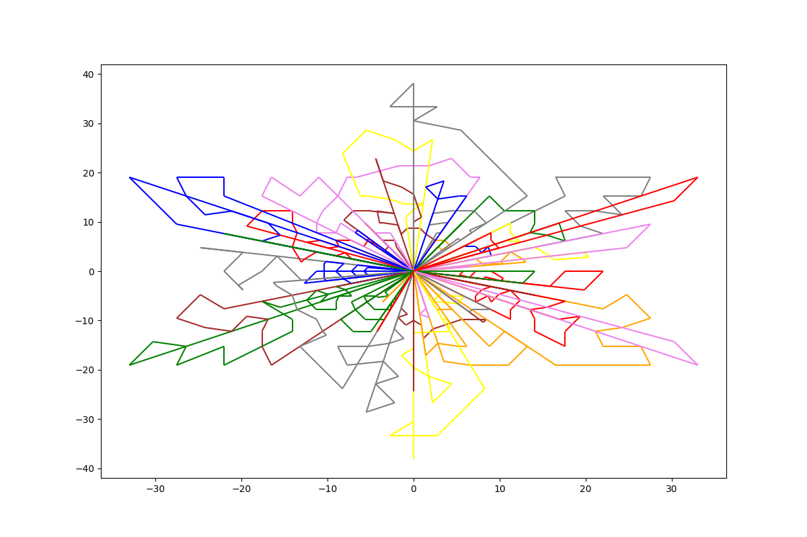
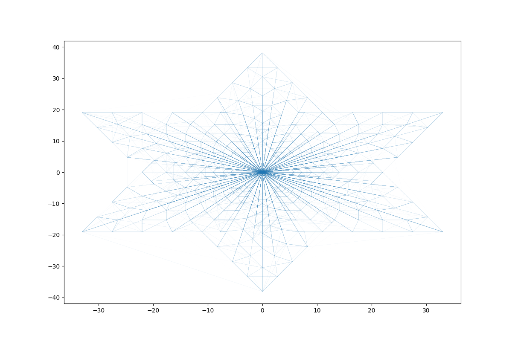
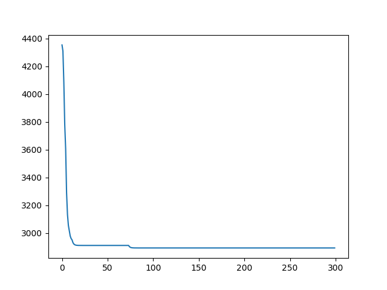

## Řešení úkolu 3

### Řešení problému
Snažil jsem se co nejvíce použít kód ze cvičení.
Konkrétně jsem se nejprve pokusil sdílet feromony pro všechny autíčka ale to mi skoro vždy zdegenerovalo.
Proto jsem nakonec feromony mezi autíčky nesdílel. Což učinilo pro autíčka obtížnější si prohodit části svých cest (ale dost možná to není potřeba).

Konkrétní rozdíly od řešení jsem popsal ve svém kódu. Nicméně nejdůležitější jsou:
- solution se skládá z několika okruhů autíček. Autíčka neobjíždí vrcholy ale jednotlivé balíčky.

Nejdůležitější se ukázalo používat správně heuristiku o preferování blízkých balíčků (nemohl jsem převzít původní, protože některé balíčky sdílejí pozici). Pokud jsem tuto heuristiku zahodil, tak se mravenci nebili schopní dopracovat rozumného řešení, protože rozdíl v fitness byl velmi malý (trochu pomohlo zvednou alpha, což zvýraznilo rozdíly ve fitness hodnotě).

Výsledek nejmenšího řešení je takovéto:

Zkoušel jsem s hrát se všemi parametry a většinou jsem nevypozoroval nějaké výrazné zlepšení.
Určitě pomohl větší čas. Zároveň mi trochu pomohlo snížit rho na .5 což si vysvětluji tak, že se umí cesty jednodušeji měnit (nejsou tak moc ovlivněny historií). Zároveň na grafu jsou vidět rozumnější feromonové cesty

Řešení s nižším `rho=0.5`:

Zároveň jsem zkoušel hýbat počtem mravenců ale to moc nepomohlo.

### Výsledky

Výsledek nejmenšího datasetu je vzdálenost `877`.

Výsledek prostředního datasetu je vzdálenost `334`.

Výsledek největšího datasetu je ale nic moc. Dost mi to zdegenerovalo jak je vidět na progressu.

Ani když jsem ladil hyper parametry přesně pro větší vstup, tak se mi nepovedlo dostat rozumné řešení (jedna iterace trvá přibližně 4 vteřiny a nechával jsem to běhat ~300 iterací).

Pro poslední stup se mi vyplatilo zvednou `alpha=.5` a `beta=2`. Trénuje se to mnohem stabilněji. Zároveň jsem použil elitismus, protože jinak bylo trénování dost nestabilní (dost často mi to zkolabovalo do nějakých `8000+` hodnot).

Nejlepší výsledek pro velký vstup: `2893`.

#### Časy
Původně mi algoritmy běželi v $\mathcal{O(n^3)}$ což bylo pro největší vstup dost nepoužitelné. Ale potom jsem znovu zkusil sjednotit pheromony do jednoho grafu a tentokrát už mi to fungovalo. Může za to elitismus, který jsem tam přidal.
Nyní už mi běží největší vsup v `~1 s/iteration`.

#### Pozorování
Vypozoroval jsem, že bylo velmi důležité správně určit heuristiku pro pravděpodobnost na základě blízkosti políček. Zároveň mi velmi pomohl elitismus bez kterého se to mnohdy nic nenaučilo.